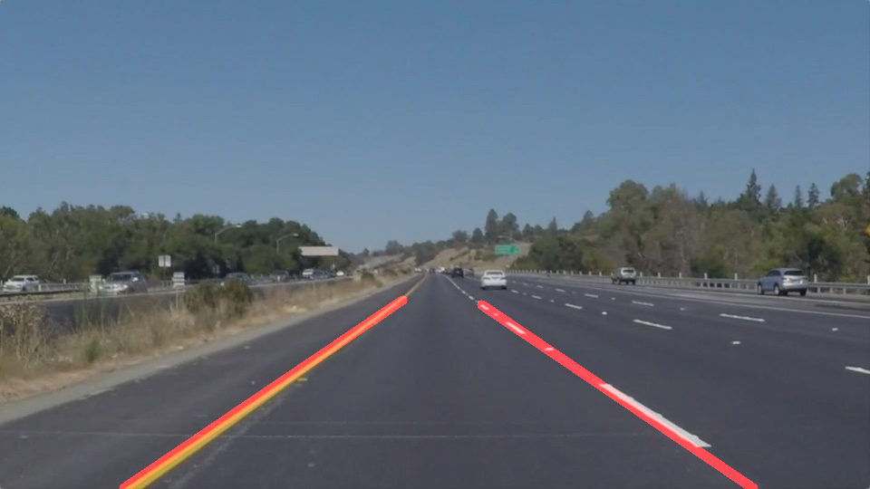

# **Finding Lane Lines on the Road** 

---

**Finding Lane Lines on the Road**

The goals / steps of this project are the following:
* Make a pipeline that finds lane lines on the road
* Reflect on your work in a written report

[//]: # (Image References)

---

### Reflection

### 1. Describe your pipeline. As part of the description, explain how you modified the draw_lines() function.

My pipeline consisted of 5 steps. First, I converted the images to grayscale, then I applied canny transform as the second step. Third, I did masking the image. Fourth, gaussian blurring. Fifth, hough transform was applied.

In order to draw a single line on the left and right lanes, I modified the draw_lines() function by using a simple calculation about slope, which is used to find the position X when Y is the same as the height of the image.

### 2. Identify potential shortcomings with your current pipeline

One potential shortcoming would be what would happen when the slope of the road changes as the center position of the image is fixed in the current logic. It is needed to exchange the information with some other sensor or utilize another machine learning logics that are more flexible to the change of the situation to solve this gap.

Another shortcoming could be what would happen when the lane lines are not straight lines but some other styles, e.g. a series of triangles or arrows.

### 3. Suggest possible improvements to your pipeline

A possible improvement would be to utilize polyfit and poly1d functions of numpy, about which I realized that there are some discussions in forum. Although I quickly try it, I couldn't get better results, then thought that the current simple math colculation might be enough for this project and it could be better from computing resource effectiveness. I must admit the current pipeline doesn't create perfect outputs for the optional challenges, while it works fine for static pictures and the first video.

Another potential improvement could be to use the average of time series information, for which more complecated structure of the program should be needed.
