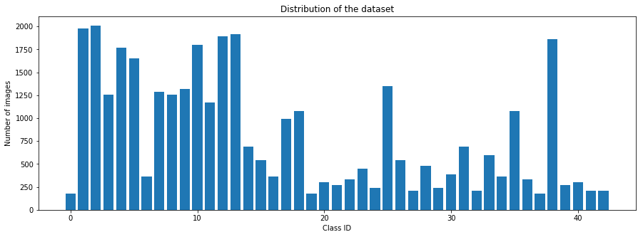
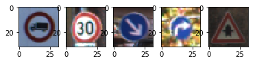
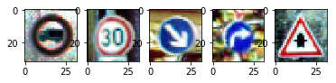
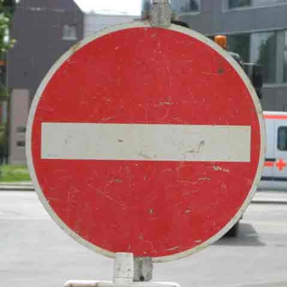
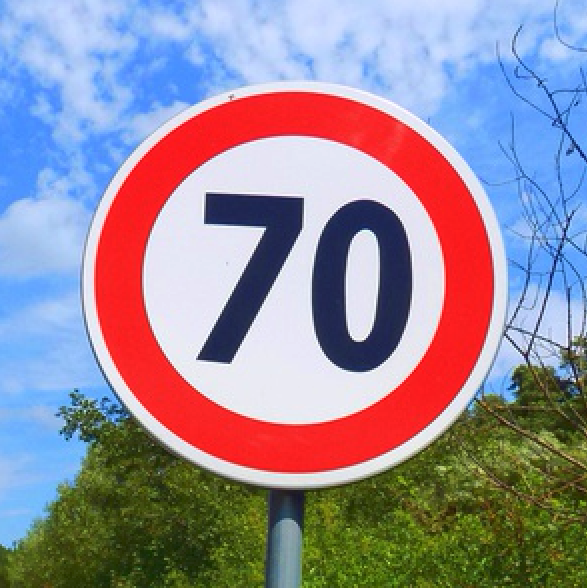
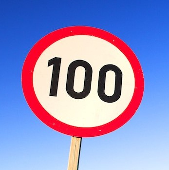
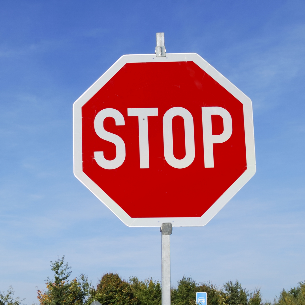
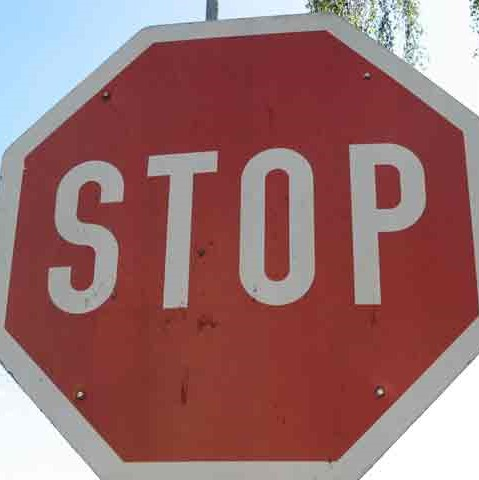
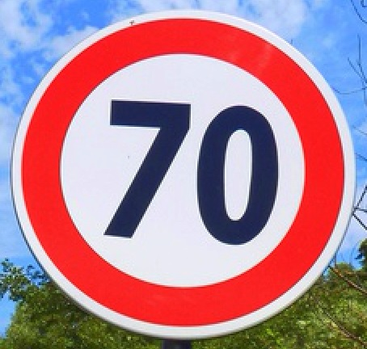

#**Traffic Sign Recognition** 

**Build a Traffic Sign Recognition Project**

The goals / steps of this project are the following:
* Load the data set (see below for links to the project data set)
* Explore, summarize and visualize the data set
* Design, train and test a model architecture
* Use the model to make predictions on new images
* Analyze the softmax probabilities of the new images
* Summarize the results with a written report

	* [data set](./traffic-signs-data) (training data isn't added to github repositry because of its size)
	* [test images](./test_images)

## Rubric Points
###Here I will consider the [rubric points](https://review.udacity.com/#!/rubrics/481/view) individually and describe how I addressed each point in my implementation.  

---
###Writeup / README

####1. Provide a Writeup / README that includes all the rubric points and how you addressed each one. You can submit your writeup as markdown or pdf. You can use this template as a guide for writing the report. The submission includes the project code.

You're reading it! and here is a link to my [project code](https://github.com/YoshiyukiKono/CarND/blob/master/project-2/Traffic_Sign_Classifier.ipynb)

###Data Set Summary & Exploration

####1. Provide a basic summary of the data set. In the code, the analysis should be done using python, numpy and/or pandas methods rather than hardcoding results manually.

I used python methods and the numpy library to calculate summary statistics of the traffic signs data set:

* The size of training set is 34799
* The size of the validation set is 4410
* The size of test set is 12630
* The shape of a traffic sign image is (32, 32, 3)
* The number of unique classes/labels in the data set is 43

####2. Include an exploratory visualization of the dataset.

Here is an exploratory visualization of the data set. It is a bar chart showing how the data is distributed.

###Design and Test a Model Architecture

####1. Describe how you preprocessed the image data. 
What techniques were chosen and why did you choose these techniques? 
Consider including images showing the output of each preprocessing technique. 
Pre-processing refers to techniques such as converting to grayscale, normalization, etc. 
(OPTIONAL: As described in the "Stand Out Suggestions" part of the rubric, if you generated additional data for training, describe why you decided to generate additional data, how you generated the data, and provide example images of the additional data. Then describe the characteristics of the augmented training set like number of images in the set, number of images for each class, etc.)

At first, I decided not to convert the images to grayscale because colors should be meaningful for traffic signs, even though it might be also designed for color blind people.

Instead, I decided to use histogram equalization to each dimention of RGB because it should mitigate unimportant small differences at a pixel level and make the data easy to calculate from the machine learning viewpoint.

Here is an example of a traffic sign image before and after histogram equalization.

As a last step, I normalized the image data to accomodate it with a proper numerical area because of the calculation logic.

I had tried to generate additional data because the size of signes in the images should differ and it was expected that some images have some spaces around the singes and some images don't.
Having said that, I finally decided not to adapt the data adaptation stratagy becuase my simple logic to zoom images didn't contribute to improve accuracy but make it lower,and I got hairly high accuracy without augumenting data set.

####2. Describe what your final model architecture looks like including model type, layers, layer sizes, connectivity, etc.) Consider including a diagram and/or table describing the final model.

My final model consisted of the following layers:

| Layer         	|     Description		        	| 
|:---------------------:|:---------------------------------------------:| 
| Input         	| 32x32x<3> RGB image   			| 
| Convolution 3x3     	| 1x1 stride, valid padding, output 28x28x6 	|
| RELU			|         					|
| Max pooling	      	| input 28X28X6, 2x2 stride,  output 14x14x6	|
| Convolution 3x3	| 1x1 stride, valid padding, output 10x10x6     |
| RELU			|         					|
| Max pooling	      	| input 10x10x6, 2x2 stride,  output 5x5x16	|
| Flatten		| input 5x5x16, output 400    			|
| Fully connected	| input 400, output 120  			|
| RELU			|         					|
| Dropout		|        					|
| Fully connected	| input 120, output 84        			|
| RELU			|         					|
| Dropout		|        					|
| Fully connected	| input 84, output<43>        			|
| Softmax		|         					|

####3. Describe how you trained your model. The discussion can include the type of optimizer, the batch size, number of epochs and any hyperparameters such as learning rate.

To train the model, I used the following:
* optimizer:Adam Optimizer
* batch size:128
* epoch:30
* learning rate:0.001
* keep probability:0.5

####4. Describe the approach taken for finding a solution and getting the validation set accuracy to be at least 0.93. Include in the discussion the results on the training, validation and test sets and where in the code these were calculated. Your approach may have been an iterative process, in which case, outline the steps you took to get to the final solution and why you chose those steps. Perhaps your solution involved an already well known implementation or architecture. In this case, discuss why you think the architecture is suitable for the current problem.

My final model results were:
* training set accuracy of 0.982
* validation set accuracy of 0.944
* test set accuracy of 0.921

If an iterative approach was chosen:
* What was the first architecture that was tried and why was it chosen?

	* The first architecture doesn't have any dropout layers. I chose this simple architecture as a start point.

* What were some problems with the initial architecture?

	* Its result wasn't so bad although validation accuracy slightly didn't reach to 0.93 and it needes many epochs to get the result.

* How was the architecture adjusted and why was it adjusted? Typical adjustments could include choosing a different model architecture, adding or taking away layers (pooling, dropout, convolution, etc), using an activation function or changing the activation function. One common justification for adjusting an architecture would be due to overfitting or underfitting. A high accuracy on the training set but low accuracy on the validation set indicates over fitting; a low accuracy on both sets indicates under fitting.

	* First, I adjusted the architechture by adding dopout layers after each RELU layers, but this architecture makes the accuraccy lower. Then, I removed dropout layers without the ones just before fully connected layers. This architecture works to contribute high accuracy.

* Which parameters were tuned? How were they adjusted and why?

	* I tried more epochs, smaller learning rate, and  with simple architecuture but it didn't change the situation drastically. After I reached the final model mentioned above, I 

* What are some of the important design choices and why were they chosen? For example, why might a convolution layer work well with this problem? How might a dropout layer help with creating a successful model?

	* I tried to use dropout layers for each activation layers. It however didn't work to improve the accuracy. Then, I removed them without the ones before fully connected layers.

If a well known architecture was chosen:

* What architecture was chosen?
	* I chose LeNet.

* Why did you believe it would be relevant to the traffic sign application?
	* LeNet is used for MNIST data set.MNIST is a data set of numerical signs. I thought that traffic signs and numerical signs should be treated in the same way, as they are both signs, that is, artificial abstract message.

* How does the final model's accuracy on the training, validation and test set provide evidence that the model is working well?

	* The final model's accuracy on the training was good.Validation accuracy and training accuracy are improvide during 30 epochs little by little without stacking to a certain number.
 

###Test a Model on New Images

####1. Choose five German traffic signs found on the web and provide them in the report. For each image, discuss what quality or qualities might be difficult to classify.

Here are five German traffic signs that I found on the web:

The first image might be difficult to classify because ...

####2. Discuss the model's predictions on these new traffic signs and compare the results to predicting on the test set. At a minimum, discuss what the predictions were, the accuracy on these new predictions, and compare the accuracy to the accuracy on the test set (OPTIONAL: Discuss the results in more detail as described in the "Stand Out Suggestions" part of the rubric).

Here are the results of the prediction:

| Image			        |     Prediction	        	| 
|:---------------------:|:---------------------------------------------:| 
| No Entry      		| No Entry   				| 
| 70 km/h     			| 70 km/h (20 km/h) 				|
| 100 km/h			| 100 km/h				|
| Stop Sign			| Priority Load				|
| Stop Sign	      		| Ahead only(Yield)			|
| 70 km/h     			| 30 km/h 				|
| Stop Sign			| Stop Sign				|

The model was able to correctly guess 5 of the 7 traffic signs in the last prediction (and 4 of the 7 traffice signs in the second to the last one), which gives an accuracy of 71% in the last prediction and as the result of the evaluate method (42% in the second to the last one). This compares favorably to the accuracy on the test set of ...
 
####3. Describe how certain the model is when predicting on each of the five new images by looking at the softmax probabilities for each prediction. Provide the top 5 softmax probabilities for each image along with the sign type of each probability. (OPTIONAL: as described in the "Stand Out Suggestions" part of the rubric, visualizations can also be provided such as bar charts)

The code for making predictions on my final model is located in the 30th cell of the Ipython notebook.

For the first image, the model is 100% sure that this is a No entry sign (probability of 1.000), and the image does contain a No entry sign. The top five soft max probabilities were:

| Probability         	|     Prediction	        		| 
|:---------------------:|:---------------------------------------------:| 
|1.000	|No entry	|
|0.000	|Stop	|
|0.000	|Road work	|
|0.000	|Bumpy road	|
|0.000	|Wild animals crossing	|

For the second image, the model is pretty sure that this is a Speed limit (70km/h) sign (probability of 0.999), but the image does contain a Speed limit (20km/h) sign. The top five soft max probabilities were:

| Probability         	|     Prediction	        		| 
|:---------------------:|:---------------------------------------------:| 
|0.999	|Speed limit (70km/h)	|
|0.001	|Speed limit (120km/h)	|
|0.000	|Speed limit (20km/h)	|
|0.000	|Speed limit (30km/h)	|
|0.000	|Speed limit (100km/h)	|

For the third image, the model is pretty sure that this is a Speed limit (100km/h) sign (probability of 0.993), and the image does certainly contain a Speed limit (100km/h) sign. The top five soft max probabilities were:

| Probability         	|     Prediction	        		| 
|:---------------------:|:---------------------------------------------:| 
|0.993	|Speed limit (100km/h)	|
|0.005	|Speed limit (80km/h)	|
|0.002	|Speed limit (50km/h)	|
|0.000	|Speed limit (30km/h)	|
|0.000	|Speed limit (120km/h)	|

For the fourth image, although the model is 100% sure that this is a Priority road sign (probability of 1.000), but the image does contain a Stop sign which is in a little distant view. The top five soft max probabilities were:

| Probability         	|     Prediction	        		| 
|:---------------------:|:---------------------------------------------:| 
|1.000	|Priority road	|
|0.000	|Road work	|
|0.000	|End of no passing by vehicles over 3.5 metric tons	|
|0.000	|Roundabout mandatory	|
|0.000	|No entry	|

For the fifth imaged, the model is relatively sure that this is an Ahead only sign (probability of 0.718), otherwise a Yield sign (probability of 0.278), and the image does contain a Stop sign, which is an angled image. The top five soft max probabilities were:

| Probability         	|     Prediction	        		| 
|:---------------------:|:---------------------------------------------:| 
|0.718	|Ahead only	|
|0.278	|Yield	|
|0.002	|Speed limit (60km/h)	|
|0.001	|Stop	|
|0.000	|No passing	|

For the sixth image, the model is almost 50% sure that this is a Speed limit (30km/h) sign (probability of 0.483), otherwise a Speed limit (70km/h) sign (probability of 0.470), and the image does contain a a Speed limit (70km/h). The top five soft max probabilities were:

| Probability         	|     Prediction	        		| 
|:---------------------:|:---------------------------------------------:| 
|0.483	|Speed limit (30km/h)	|
|0.470	|Speed limit (70km/h)	|
|0.032	|Speed limit (20km/h)	|
|0.013	|End of speed limit (80km/h)	|
|0.003	|End of all speed and passing limits	|

For the seventh image, the model is 100% sure that this is a Stop sign (probability of 1.000), and the image does contain a a Stop sign, which is located at the center of the image with neither angle nor distance. The top five soft max probabilities were:

| Probability         	|     Prediction	        		| 
|:---------------------:|:---------------------------------------------:| 
|1.000	|Stop	|
|0.000	|Speed limit (30km/h)	|
|0.000	|Yield	|
|0.000	|Road work	|
|0.000	|No vehicles	|

### (Optional) Visualizing the Neural Network (See Step 4 of the Ipython notebook for more details)
####1. Discuss the visual output of your trained network's feature maps. What characteristics did the neural network use to make classifications?

I omitted the optional excercise.