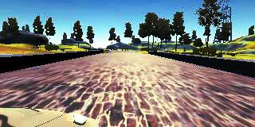
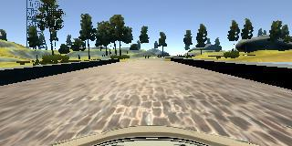
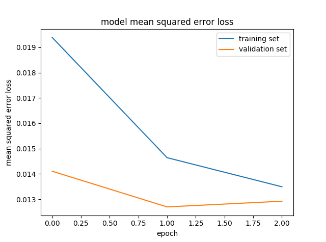

**Behavioral Cloning Project**

The goals / steps of this project are the following:
* Use the simulator to collect data of good driving behavior
* Build, a convolution neural network in Keras that predicts steering angles from images
* Train and validate the model with a training and validation set
* Test that the model successfully drives around track one without leaving the road
* Summarize the results with a written report

## Rubric Points
### Here I will consider the [rubric points](https://review.udacity.com/#!/rubrics/432/view) individually and describe how I addressed each point in my implementation.  

---
### Files Submitted & Code Quality

#### 1. Submission includes all required files and can be used to run the simulator in autonomous mode

My project includes the following files:
* model.py containing the script to create and train the model
* drive.py for driving the car in autonomous mode
* model.h5 containing a trained convolution neural network 
* writeup.md summarizing the results
* run.mp4 as the evidence of running the simulator in autonomous mode using the above model.h5

#### 2. Submission includes functional code
Using the Udacity provided simulator and my drive.py file, the car can be driven autonomously around the track by executing 
```sh
python drive.py model.h5
```

#### 3. Submission code is usable and readable

The model.py file contains the code for training and saving the convolution neural network. The file shows the pipeline I used for training and validating the model, and it contains comments to explain how the code works.

### Model Architecture and Training Strategy

#### 1. An appropriate model architecture has been employed

My model is a convolution neural network constructed based on the model designed by NVIDEA.
The model includes RELU layers to introduce nonlinearity, and the data is normalized in the model using a Keras lambda layers. 
For details about the model, see the next section.

#### 2. Attempts to reduce overfitting in the model

The model contains dropout layers in order to reduce overfitting. 

The model was trained and validated on different data sets to ensure that the model was not overfitting using Keras function. The model was tested by running it through the simulator and ensuring that the vehicle could stay on the track.

#### 3. Model parameter tuning

The model used an adam optimizer, so the learning rate is not tuned manually.

#### 4. Appropriate training data

Training data was chosen to keep the vehicle driving on the road.

For details about how I created the training data, see the next section. 

### Model Architecture and Training Strategy

#### 1. Solution Design Approach

My first step was to use a convolution neural network model similar to the LeNet as the one that I have a track record to use for the previous project.

In order to gauge how well the model was working, I split my image and steering angle data into a training and validation set. I found that my first model had a low mean squared error on the training set but a high mean squared error on the validation set. This implied that the model was overfitting.

Then I switched my model from LeNet to the one designed by NVIDEA, which is introduced in Udacity course.

There were a few spots where the vehicle fell off the track. To improve the driving behavior in these cases, I modified my model as follows:

* Histogram Equalization to be applied to the training images for
feature value optimization

* Transformation from RGB to Gray-scale in the model to reduce the dimension  for calculation improvement

In my observation, histogram equalization contributed significantly. When applying the transformation to the left and right angle images only, I got the best result.

The sample images are below.




At the end of the process, the vehicle is able to drive autonomously around the track without leaving the road.

However, although the drive through the track 1 is smooth overall, but the car is touching the lane at few positions on the road. It was suggested by the reviewer when I submitted my project for the first time.

Taking into account the reviewer's suggestions, I changed my model as follows:

* Correct the confusion of RGB and BGR in my code
* Use Generator

To correct the first confusion, I stopped using opencv to read the images because it reads images as BGR format, and changed to use PIL that is used in drive.py and reads images as RGB. I didn't change the model where RGB is expected.

When I added generator to my code, I changed how to treat test and validation data set. I was using the same function for these data set and training data set, but I thought that validation and test data set must be similar to the data set used for prediction and the left and right angle images and transformed images should not be used for the purpose.

#### 2. Final Model Architecture

The final model architecture (model.py: "build_model" function) consisted of the following layers:

| Layer         	|     Description		        	| 
|:---------------------:|:---------------------------------------------:| 
| Input         	| 160x320x3 RGB image   			| 
| Lambda		| Dimension reduction   			|
| Cropping2D	      	| top: 70, bottom: 25, right: 0, left: 0	|
| Convolution2D		| filter:24, kernal:5x5, strides: 2x2 activation: RELU	|
| Convolution2D		| filter:36, kernal:5x5, strides: 2x2 activation: RELU	|
| Convolution2D	      	| filter:48, kernal:5x5, strides: 2x2 activation: RELU	|
| Convolution2D		| filter:64, kernal:3x3, activation: RELU	|
| Convolution2D		| filter:64, kernal:3x3, activation: RELU	|
| Dropout		| keep probability: 0.5        			|
| Flatten		|        					|
| Dence			| unit: 100	        			|
| Dence			| unit: 50	        			|
| Dence			| unit: 10	        			|
| Dence			| unit: 1	        			|


#### 3. Creation of the Training Set & Training Process

To train my model I utilized the provided training data with augmenting it.

Here is the ways that I augmented data:
* Flipping the image and steering angle
* Using right and left images by multiple cameras and adjusted steering angle





I put 20 % of the data into a test set.
I randomly shuffled the data set and put 20% of the data into a validation set using two different generators for training and validation.

Each number of data set is below:
* 25712 samples for training (validate on 6432 samples)
* 6432 samples for test

I used this training data for training the model.
The validation set helped determine if the model was over or under fitting. I utilized Keras's EearlyStopping callback to judge when the training should be stopped.

With my model and training data, the ideal number of epochs was 4 (almost similar to the 3rd epoch though) as shown below.

* Epoch 1 loss: 0.0201 - val_loss: 0.0106 
* Epoch 2 loss: 0.0144 - val_loss: 0.0097
* Epoch 3 loss: 0.0133 - val_loss: 0.0093
* Epoch 4 loss: 0.0125 - val_loss: 0.0092
* Epoch 5 loss: 0.0121 - val_loss: 0.0093



The loss score of the test data set is below:

Score: 0.0118042428008


