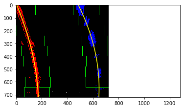

**Advanced Lane Finding Project**

The goals / steps of this project are the following:

* Compute the camera calibration matrix and distortion coefficients given a set of chessboard images.
* Apply a distortion correction to raw images.
* Use color transforms, gradients, etc., to create a thresholded binary image.
* Apply a perspective transform to rectify binary image ("birds-eye view").
* Detect lane pixels and fit to find the lane boundary.
* Determine the curvature of the lane and vehicle position with respect to center.
* Warp the detected lane boundaries back onto the original image.
* Output visual display of the lane boundaries and numerical estimation of lane curvature and vehicle position.

[//]: # (Image References)

[image1](./writeup_images/chess_dist.png) "Undistorted"

[image2](./writeup_images/lane_dist.png) "Road Transformed"

[image3](./writeup_images/thres_bin.png) "Binary Example"

[image4](./writeup_images/compare_src_dst.png) "Warp Example"

[image5](./writeup_images/poly.png) "Fit Visual"

[image6](./writeup_images/lane_proj.png) "Plotted Down Output Example"

[video1](./output_images/project_video_output.mp4) "Project Output"

[video2](./output_images/challenge_video_output.mp4) "Challenge Output"

## [Rubric](https://review.udacity.com/#!/rubrics/571/view) Points

### Here I will consider the rubric points individually and describe how I addressed each point in my implementation.  

---

### Writeup / README

#### 1. Provide a Writeup / README that includes all the rubric points and how you addressed each one.  You can submit your writeup as markdown or pdf.  

You're reading it!

### Camera Calibration

#### 1. Briefly state how you computed the camera matrix and distortion coefficients. Provide an example of a distortion corrected calibration image.

The code for this step is contained from the 6th to the 10th code cells of the IPython notebook located in "./Advanced_Lane_Lines.ipynb".  

I start by preparing "object points", which will be the (x, y, z) coordinates of the chessboard corners in the world. Here I am assuming the chessboard is fixed on the (x, y) plane at z=0, such that the object points are the same for each calibration image.  Thus, `objp` is just a replicated array of coordinates, and `objpoints` will be appended with a copy of it every time I successfully detect all chessboard corners in a test image.  `imgpoints` will be appended with the (x, y) pixel position of each of the corners in the image plane with each successful chessboard detection.  

I then used the output `objpoints` and `imgpoints` to compute the camera calibration and distortion coefficients using the `cv2.calibrateCamera()` function.  I applied this distortion correction to the test image using the `cv2.undistort()` function and obtained this result: 


### Pipeline (single images)

#### 1. Provide an example of a distortion-corrected image.

To demonstrate this step, I will describe how I apply the distortion correction to one of the test images like this one:


#### 2. Describe how (and identify where in your code) you used color transforms, gradients or other methods to create a thresholded binary image.  Provide an example of a binary image result.

I used a combination of color and gradient thresholds to generate a binary image (from the 11th to the 13th code cells of the "./Advanced_Lane_Lines.ipynb").  Here's an example of my output for this step.


#### 3. Describe how (and identify where in your code) you performed a perspective transform and provide an example of a transformed image.

The code for my perspective transform includes a function called `pipeline_warp()`, which appears in the 15th code cell of the "./Advanced_Lane_Lines.ipynb".  The `pipeline_warp()` function takes as inputs an image (`image`), and source (`src`) and destination (`dst`) points are defined in the function.  I chose the hardcode the source and destination points in the following manner:

```python
Y_BTM = 668

X_CTR = 640 # 1280/2

X_TOP_WDT = 120
X_BTM_WDT = 1000

Y_TOP = 460
X_TOP_WDT = 150

TOP_LEFT = (X_CTR - X_TOP_WDT/2 , Y_TOP)
TOP_RIGHT = (X_CTR + X_TOP_WDT/2, Y_TOP)
BTM_LEFT = (X_CTR - X_BTM_WDT/2 , Y_BTM)
BTM_RIGHT = (X_CTR + X_BTM_WDT/2, Y_BTM)

SRC_TRAPEZOID = [TOP_LEFT, TOP_RIGHT, BTM_RIGHT, BTM_LEFT]
src = np.float32(SRC_TRAPEZOID)

offset = 100 # offset for dst points
img_size = (image.shape[1], image.shape[0])
w = img_size[1]
h = img_size[1]
offsetY = 0
offsetX = 50
dst = np.float32([[offsetX, offsetY], [w - offsetX, offsetY], 
                      [w - offsetX, h - offsetY],
                      [offsetX, h - offsetY]])
```

This resulted in the following source and destination points:

| Source        | Destination   | 
|:-------------:|:-------------:| 
| 580,   450      | 50,    0        | 
| 700,   450      | 670,    0      |
| 1140,   668     | 670,  720      |
| 140,   668      | 50,  720        |

I verified that my perspective transform was working as expected by drawing the `src` and `dst` points onto a test image and its warped counterpart to verify that the lines appear parallel in the warped image.


#### 4. Describe how (and identify where in your code) you identified lane-line pixels and fit their positions with a polynomial?


Then, in the 27th code cell of the "./Advanced_Lane_Lines.ipynb", I did some other stuff and fit my lane lines with a 2nd order polynomial kinda like this:



#### 5. Describe how (and identify where in your code) you calculated the radius of curvature of the lane and the position of the vehicle with respect to center.

I did the calculation of the radius of curvature of the lane in the 19th code cell of the "./Advanced_Lane_Lines.ipynb".

The position of the vehicle with respect to center is treated in the 18th code cell of the "./Advanced_Lane_Lines.ipynb".

#### 6. Provide an example image of your result plotted back down onto the road such that the lane area is identified clearly.

I implemented this step in the 26th code cell of the "./Advanced_Lane_Lines.ipynb" in the function `project_lane()` of the class `LaneProjector()`.  Here is an example of my result on a test image:


---

### Pipeline (video)

#### 1. Provide a link to your final video output.  Your pipeline should perform reasonably well on the entire project video (wobbly lines are ok but no catastrophic failures that would cause the car to drive off the road!).

Here's a [link to my video result](./output_images/project_video_output.mp4)

Here's a [link to my challenge video result](./output_images/challenge_video_output.mp4)

---

### Discussion

#### 1. Briefly discuss any problems / issues you faced in your implementation of this project.  Where will your pipeline likely fail?  What could you do to make it more robust?

First,I'll talk about the approach I took. I was checking my pipeline using challenge_video.mp4 from the very beggining of the pipeline improvement, so that I was aware of problematic results.

My pipeline at the ealiest stage, which was implemented without the strategy to have two different functions to find lines, failed to process the images having the cracks on the center of the lane. 
Also, I faced the situation that my pipeline failed to process the images under the bridge. 

Then, I added another function to use the result of the previous lane search when finding lines.
I also started to use averaged polynomial coefficients and remove outlier data.

Regarding how I might improve it if I were going to pursue this project further, I like to consider how to use historical records to get better result, for example, how many times to keep the results of latest iterations to calculate the average, and what is the best way to eliminate outlier data.
