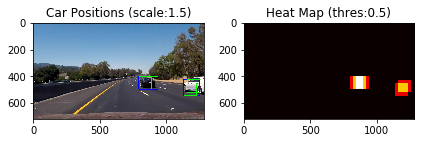
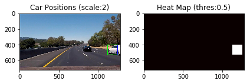

**Vehicle Detection Project**

The goals / steps of this project are the following:

* Perform a Histogram of Oriented Gradients (HOG) feature extraction on a labeled training set of images and train a classifier Linear SVM classifier
* Optionally, you can also apply a color transform and append binned color features, as well as histograms of color, to your HOG feature vector. 
* Note: for those first two steps don't forget to normalize your features and randomize a selection for training and testing.
* Implement a sliding-window technique and use your trained classifier to search for vehicles in images.
* Run your pipeline on a video stream (start with the test_video.mp4 and later implement on full project_video.mp4) and create a heat map of recurring detections frame by frame to reject outliers and follow detected vehicles.
* Estimate a bounding box for vehicles detected.

## [Rubric](https://review.udacity.com/#!/rubrics/513/view) Points
### Here I will consider the rubric points individually and describe how I addressed each point in my implementation.  

---
### Writeup / README

#### 1. Provide a Writeup / README that includes all the rubric points and how you addressed each one.  You can submit your writeup as markdown or pdf.  [Here](https://github.com/udacity/CarND-Vehicle-Detection/blob/master/writeup_template.md) is a template writeup for this project you can use as a guide and a starting point.  

Thanks for your reading this!

### Histogram of Oriented Gradients (HOG)

#### 1. Explain how (and identify where in your code) you extracted HOG features from the training images.

The code for this step is contained in the code cells under the chapter `2. HOG Features` of the IPython notebook (the file called `Vehicle_Detection.ipynb`).  

I started by reading in all the `vehicle` and `non-vehicle` images.  
Images are taken from [Here](https://s3.amazonaws.com/udacity-sdc/Vehicle_Tracking/vehicles.zip) for vehicles and [Here](https://s3.amazonaws.com/udacity-sdc/Vehicle_Tracking/non-vehicles.zip) for non-vehicles
Here is an example of one of each of the `vehicle` and `non-vehicle` classes:


I grabbed random images from each of the two classes and displayed them to get a feel for what the `skimage.hog()` output looks like.

Here is an example using the `RGB` color space and HOG parameters of `orientations=9`, `pixels_per_cell=(8, 8)` and `cells_per_block=(2, 2)`:


#### 2. Explain how you settled on your final choice of HOG parameters.

I tried various combinations of parameters and used the following parameter in my project.

| Parameter        | Value   | Remarks   | 
|:-------------:|:-------------:| :-------------|
|color_space  |HSV  | Can be RGB, HSV, LUV, HLS, YUV, YCrCb |
|orient       |9  | HOG orientations |
|pix_per_cell |8  | HOG pixels per cell |
|cell_per_block |2  | HOG cells per block |
|hog_channel |ALL | Can be 0, 1, 2, or "ALL" |

To reach the above combination, I compared each accuracy for some combinations, as follows:
* HSV is the best of color spaces
* hog_channel: All is better than 1
* for the other parameters, I chose these values from sample code or forum recomendation

#### 3. Describe how (and identify where in your code) you trained a classifier using your selected HOG features (and color features if you used them).

I trained a linear SVM using HOG, Color Histogram, and Spatial Binding futures.

| Parameter        | Value   | Remarks   | 
|:-------------:|:-------------:| :-------------|
|spatial_size |(16, 16)  | Spatial binning dimensions |
|hist_bins |16 | Number of histogram bins |
|spatial_feat |True  | Spatial features on or off |
|hist_feat |True  | Histogram features on or off |
|hog_feat |True  | HOG features on or off |

* hist_bin: 16 is better than 32
* for the other parameters, I chose these values from sample code or forum recomendation

### Sliding Window Search

#### 1. Describe how (and identify where in your code) you implemented a sliding window search.  How did you decide what scales to search and how much to overlap windows?

I decided to use two types of scale when searching cars: 1.5, 2. First of all, I used the bottom half of the image to search cars, as it covers the area of the load. Then, the first scale, 1.5, is used to search in the top half of the trimed image where cars look small. Then the second scale was used for the entire image (of the half of the original image).


#### 2. Show some examples of test images to demonstrate how your pipeline is working.  What did you do to optimize the performance of your classifier?

I searched on two scales using HSV 3-channel HOG features plus spatially binned color and histograms of color in the feature vector.
Here are some example images:


Before I decided the scales, I tried some thresholds and scales individually, then chose the threshold, 1.5, and the scales, 1.5 and 2, which derives the best result when processing the video.




Regarding the performance of my classifier, I used sklearn's `grid_search.GridSearchCV` and challenged each classifier to predict test data set.

The result of Cross-Validation using `tuned_parameters = {'kernel':['linear'], 'C':[0.1, 0.5, 1]}`
```

START to train SVC(with GridSearchCV)...
2028.56 Seconds to train SVC(with GridSearchCV)...
Best Parameters: {'C': 0.1, 'kernel': 'linear'}
Best cross-validation score: 0.99
[mean: 0.98909, std: 0.00100, params: {'C': 0.1, 'kernel': 'linear'}, mean: 0.98909, std: 0.00100, params: {'C': 0.5, 'kernel': 'linear'}, mean: 0.98909, std: 0.00100, params: {'C': 1, 'kernel': 'linear'}]
[mean: 0.98909, std: 0.00100, params: {'C': 0.1, 'kernel': 'linear'}, mean: 0.98909, std: 0.00100, params: {'C': 0.5, 'kernel': 'linear'}, mean: 0.98909, std: 0.00100, params: {'C': 1, 'kernel': 'linear'}]
Test Accuracy of SVC =  0.9901
My SVC predicts:  [ 1.  0.  1.  0.  0.  1.  0.  0.  1.  1.]
For these 10 labels:  [ 1.  0.  1.  0.  0.  1.  0.  0.  1.  1.]
0.0904710293 Seconds to predict 10 labels with SVC
```
The result of `tuned_parameters = {'kernel':['linear'], 'C':[0.001, 0.01, 0.05, 0.1]}`.

Although GridSearchCV suggested C=0.001 is the best parameter, I chose C=0.1 with comprehensive consideration because each validation score is almost similar but it is far shorter time to predict with the latter parameter than the farmer.

```
START to train SVC(with GridSearchCV)...
2639.71 Seconds to train SVC(with GridSearchCV)...
Best Parameters: {'C': 0.001, 'kernel': 'linear'}
Best cross-validation score: 0.99
[mean: 0.98951, std: 0.00170, params: {'C': 0.001, 'kernel': 'linear'}, mean: 0.98923, std: 0.00131, params: {'C': 0.01, 'kernel': 'linear'}, mean: 0.98923, std: 0.00131, params: {'C': 0.05, 'kernel': 'linear'}, mean: 0.98923, std: 0.00131, params: {'C': 0.1, 'kernel': 'linear'}]
[mean: 0.98951, std: 0.00170, params: {'C': 0.001, 'kernel': 'linear'}, mean: 0.98923, std: 0.00131, params: {'C': 0.01, 'kernel': 'linear'}, mean: 0.98923, std: 0.00131, params: {'C': 0.05, 'kernel': 'linear'}, mean: 0.98923, std: 0.00131, params: {'C': 0.1, 'kernel': 'linear'}]
Test Accuracy of SVC =  0.9904
My SVC predicts:  [ 0.  1.  0.  0.  1.  0.  0.  0.  1.  0.]
For these 10 labels:  [ 0.  1.  0.  0.  1.  0.  0.  0.  1.  0.]
0.0717737675 Seconds to predict 10 labels with SVC
```

---

### Video Implementation

#### 1. Provide a link to your final video output.  Your pipeline should perform reasonably well on the entire project video (somewhat wobbly or unstable bounding boxes are ok as long as you are identifying the vehicles most of the time with minimal false positives.)

Here's a [link to my video result](./output_images/project_video_out.mp4)


#### 2. Describe how (and identify where in your code) you implemented some kind of filter for false positives and some method for combining overlapping bounding boxes.

I recorded the positions of positive detections in each frame of the video.  From the positive detections I created a heatmap and then thresholded that map to identify vehicle positions.  I then used `scipy.ndimage.measurements.label()` to identify individual blobs in the heatmap.  I then assumed each blob corresponded to a vehicle.  I constructed bounding boxes to cover the area of each blob detected.  

When processing the video, I used deque to use the average of heatmap values in some frames.

After the first review, I changed my pipeline using some of the suggestions provided by the reviewer:

* Apply the search area limitation for x axis of images
* Use another color space, YUV
* Increase the number of data by augumentation (flipping images)

Using the YUV color space helped a lot to reduce false positives, and data augumentation seemingly contributed it somehow.

Then, I modified the parameters when processing the video:

* Use the higher threshold for heatmap (from 0.5 to 1) to ignore weak false positives

As a result, I succeeded to significantly reduce false positives that would cause crtical accidents.

---

### Discussion

#### 1. Briefly discuss any problems / issues you faced in your implementation of this project.  Where will your pipeline likely fail?  What could you do to make it more robust?

An example of issues that I faced was the scale of cars. I solved the issue as I mentioned above.
My approach was step by step basis. I tried to meet issues as each one is a small chunk.

My pipeline will fail when unexpected objects appear on the road (My pipeline is certainly not robust about the cars running the opposite lane and when driving under the shadow of trees).
Another example is when the driving situation changes, like rain or snow.
If I were going to pursue this project further, I may try to improve my pipeline to accomodate with different situations although it would need to use plenty of time.
Or, when I recall closely what I did, I will try more valiation of parameters, scales, and target areas where cars are supposed to be detected.
